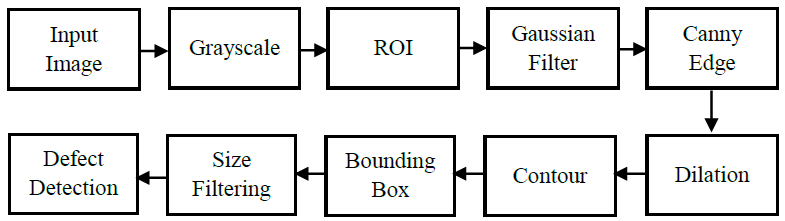
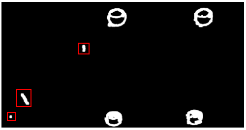
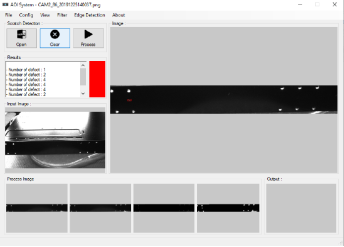
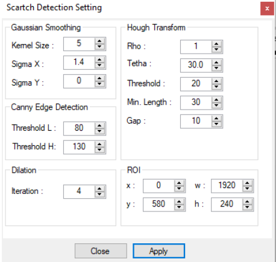

# Scracth-Detection-for-Automated-Optical-Inpection-AOI

Automated optical inspection (AOI) is getting popular in quality control in manufacturing industry. There is a huge demand to install AOI system in production line seamlessly. Thus, a challenging problem which arises from rapid production is how to control the quality of product in reasonable amount of time.
This project developed an AOI system to inspect the defect on metal surface in a production lines. The type of the defects is a scratch defect. Here, we proposed a method of detecting the defect using several steps of digital image processing, including: 
(1) ROI
(2) Gaussian filtering
(3) Canny edge detection
(4) Dilation
(5) Contour
(6) Bounding box, and 
(7) size filtering

## Defect Detection Method

In this project, the metal surface inspection for detection the defects are performed by using digital image processing. Overall, the image processing consist of 8 steps. The first step is convert the input image (BGR) into a grayscale image (GRAY). Then, we used the Region of Interest (ROI) to select the detection area to eliminate the are outside the target of interest. By performing ROI, it can also eliminate the noice caused by the image background and the other objects around the target of interest. After that, we use 2-D Gaussian filtering to smooth the image. This process intend to reduce the noise in the image before processing the edge detection using Canny Edge Detection. Canny method is of the most commonly used image processing tools for edge detection in very robust manner. By performing edge detection, we can find all the edge in the image including the edge of the scratch defect. In the next step, we need to eliminate the edge that are not the defect. Firstly, we perform morphological operation using dilation to thick the line edge resulted by Canny. Then we used the contour detection and then determine the bounding box for each contour. At the last step, we filter the scratch based on the size of the contour and then we draw the bounding box in the image to show the defect area.

## 1. 2D gaussian filtering

The input images have a lot of noise due to unstable lighting conditions. The noises of the image need to be reduced in order to minimize the noise when performing the edge detection. Here, Gaussian filter is used for blurring and noise reduction. Blurring is used in preprocessing tasks, such as removal of small details from an image and bridging of small gaps in lines or curves. Noise reduction can be accomplished by blurring with a linear and nonlinear filtering.

## 2. Canny Edge Detection

Canny edge detection is one of the most commonly used image processing method for edge detection in very robust manner. 

## 3. Image Morphology (Dilation)

Morphology is a broad set of image processing operations that process images based on shapes. Morphological operations apply a structuring element to an input image, creating an output image of the same size. In a morphological operation, the value of each pixel in the output image is based on a comparison of the corresponding pixel in the input image with its neighbors. Dilation is a transformation that produces an image that is the same shape as the original, but is a different size. Dilation adds pixels to the bounddaries of objects in an image. Morphological dilation makes objects more visible and fills in small holes in objects.

## 4. Contours

A countour is a collection of a series of points in an image that represent boundaries. Although the edge detection algorithm can check the pixel of the contour boundary based on the difference between pixels, it does not represent the contour as a whole. Opencv can be used to extract outlines from a two-value image using the `Findcontours()` function.

## 5. Bounding Box

Bounding boxes are imaginary boxes that are around object which being checked for collision. In digital image processing, the bounding box is merely the coordinates of the rectangular border that fully encloses a digital imae when it is placed over a page, a canvas, a screen, or other similar bi-dimensional background.

## UI Software Interface of the AOI system

This project develops the AOI system by using Visual Studio 2017 and OpenCV libraries. The UI software allows the user to input the image and then apply the image procesing method to detect the defect on the objects.

# Results

In this project, the AOI system was implemented to detect the scratch defect on metal surface in a metal case industry. The object consist of five side surface, top surface and four side surface. However, in this project we just use one side surface which has some defects. We tested four different images which have different field of view (FOV). In this experiments, we evaluate the performance of the proposed image processing method in each steps and observe the impact of adjusting the parameter in order to find the best parameter setting to detect the defect clearly.

